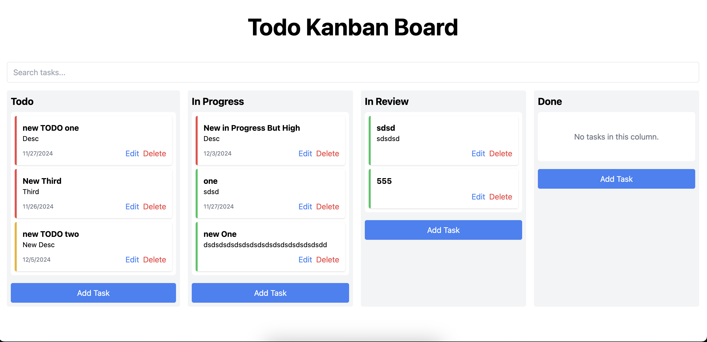

# ToDo Kanban Board App



A simple and intuitive ToDo Kanban board application built with **Vue 3**, **TypeScript**, and **Tailwind CSS**. This app allows users to manage tasks efficiently by adding, editing, deleting, and moving tasks between different columns. It features drag-and-drop functionality, search capability, task prioritization, and persistent storage using local storage.

---

## Table of Contents

- [Features](#features)
- [Demo](#demo)
- [Built With](#built-with)
- [Getting Started](#getting-started)
  - [Prerequisites](#prerequisites)
  - [Installation](#installation)
- [Running the Application](#running-the-application)
  - [Development Server](#development-server)
  - [Building for Production](#building-for-production)
  - [Running the Production Build Locally](#running-the-production-build-locally)
- [Project Structure](#project-structure)
- [Usage](#usage)
  - [Adding a Task](#adding-a-task)
  - [Editing a Task](#editing-a-task)
  - [Deleting a Task](#deleting-a-task)
  - [Moving Tasks](#moving-tasks)
  - [Searching for Tasks](#searching-for-tasks)

---

## Features

- **Add, Edit, and Delete Tasks:** Manage your tasks with a user-friendly interface.
- **Drag-and-Drop:** Rearrange tasks by dragging and dropping them between columns.
- **Search Functionality:** Quickly find tasks by keywords in the title or description.
- **Task Prioritization:** Organize tasks by priority levels—low, medium, and high.
- **Persistent Storage:** Tasks are saved in local storage, ensuring data persistence across sessions.
- **Responsive Design:** Optimized for both desktop and mobile devices.

---

## Demo

There is no current live demo

---

## Built With

- [Vue 3](https://vuejs.org/)
- [TypeScript](https://www.typescriptlang.org/)
- [Vite](https://vitejs.dev/) (Build Tool)
- [Tailwind CSS](https://tailwindcss.com/)
- [Vue Draggable](https://github.com/SortableJS/vue.draggable.next)
- [Pinia](https://pinia.vuejs.org/) (State Management)

---

## Getting Started

Follow these instructions to set up and run the project locally.

### Prerequisites

Ensure you have the following installed on your machine:

- **Node.js** (version 14 or higher)
- **Yarn** or **npm**

You can download Node.js from [here](https://nodejs.org/).

---

### Installation

1. **Clone the Repository**

   ```bash
   git clone https://github.com/your-username/kanban-board-app.git
   ```

2. **Navigate to the Project Directory**

   ```bash
   cd kanban-board-app
   ```

3. **Install Dependencies**

   ```bash
   yarn install
   ```

---

### Running the Application

#### Development Server

Start the development server to run the app locally.

Using **Yarn:**

```bash
yarn dev
```

#### Building for Production

To build the application for production:

Using **Yarn:**

```bash
yarn build
```

- The built files will be in the dist directory.

#### Building for Production

You can preview the production build locally using Vite’s preview command.

Using **Yarn:**

```bash
yarn preview
```

- The application will be available at http://localhost:4173/ (default Vite preview port).

---

### Project Structure

```bash
kanban-board-app/
├── public/
│ └── screenshots/
│ └── kanban-board.png
├── src/
│ ├── assets/
│ ├── components/
│ │ ├── KanbanBoard.vue
│ │ ├── KanbanColumn.vue
│ │ ├── TaskCard.vue
│ │ └── TaskFormModal.vue
│ ├── store/
│ │ └── useTaskStore.ts
│ ├── types/
│ │ └── task.ts
│ ├── App.vue
│ ├── main.ts
│ └── style.css
├── .gitignore
├── package.json
├── postcss.config.js
├── tailwind.config.js
├── tsconfig.json
├── vite.config.ts
└── README.md
```

---

### Usage

## Adding a Task

1. Click on the **“Add Task”** button in any column.
2. Fill out the task details in the modal form:
   - **Title**: (Required)
   - **Description**: (Optional)
   - **Due Date**: (Optional)
   - **Priority**: Select between low, medium, or high.
3. Click **“Create”** to add the task.

## Editing a Task

1. Click the **“Edit”** button on a task card.
2. Modify the task details in the modal form.
3. Click **“Update”** to save changes.

## Deleting a Task

1. Click the **“Delete”** button on a task card.
2. Confirm the deletion if prompted.

## Moving Tasks

- **Drag-and-Drop**: Click and hold a task card, then drag it to the desired column and release to move it.
- **Note**: Tasks can be moved between columns even if the target column is empty.

## Searching for Tasks

1. Use the search input at the top of the Kanban board.
2. Type keywords related to the task’s title or description.
3. The task lists will dynamically filter to show matching tasks across all columns.
